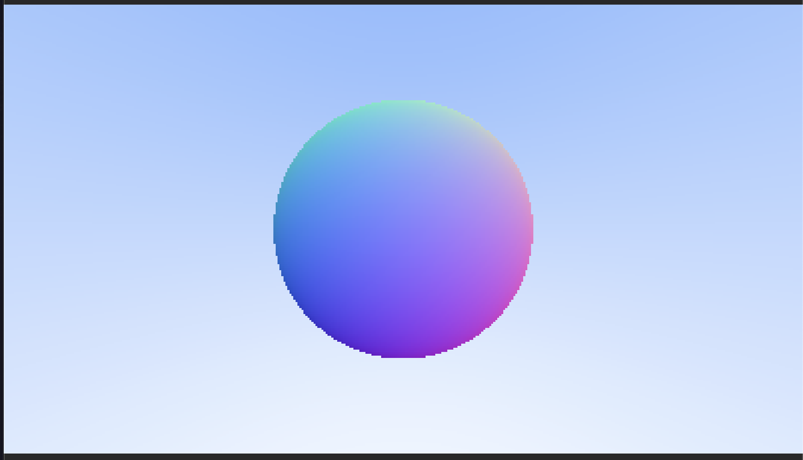

# Ray Tracing in One Weekend - Elixir Implementation

This project is an implementation of the *Ray Tracing in One Weekend* tutorial using Elixir. The goal is to build a simple ray tracer from scratch, learning about rendering, lighting, and materials along the way.

## Current Progress
I am currently at the step where a sphere is colored according to its normal vectors.

## Usage
Modify the `raytracing.ex` file to experiment with different rendering techniques.

## Next Steps
- Implement simple diffuse shading
- Add reflections and materials
- Introduce multiple objects and a scene

## References
- *Ray Tracing in One Weekend* by Peter Shirley

